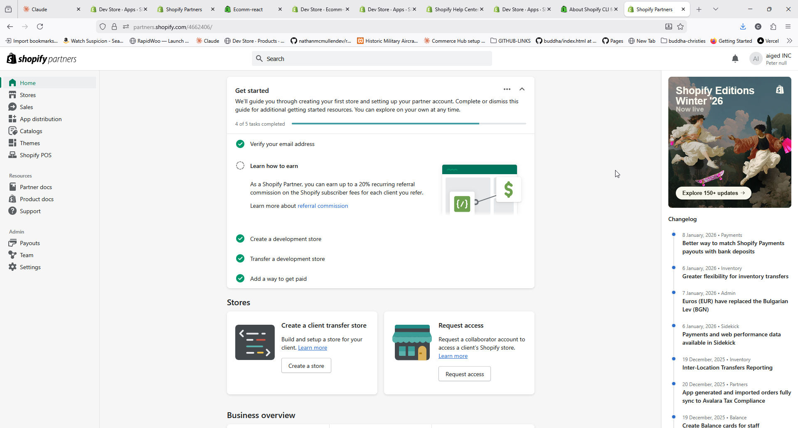
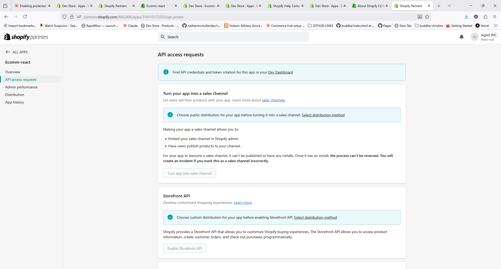
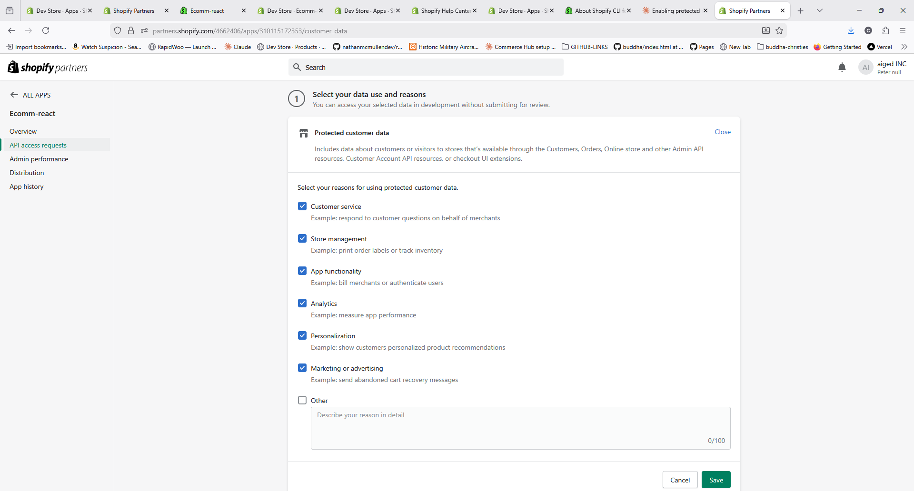
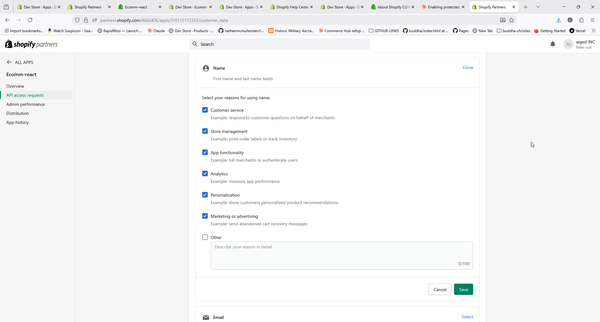
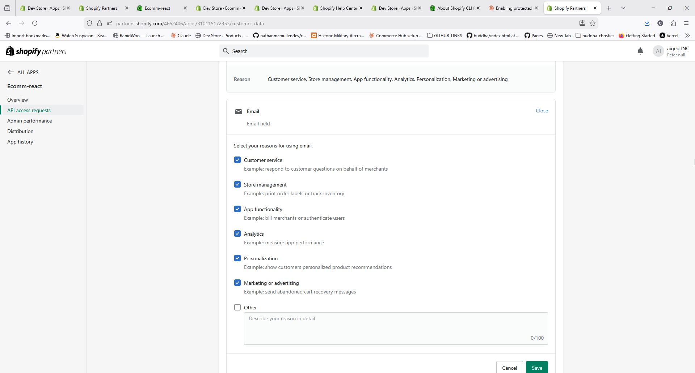
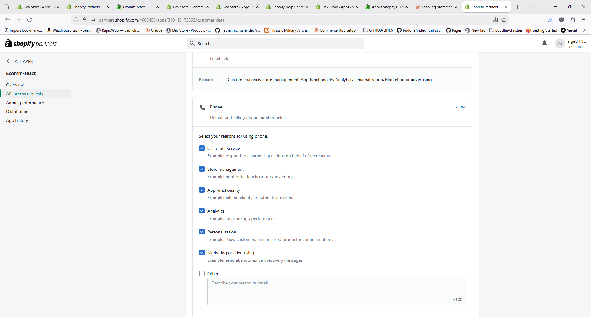
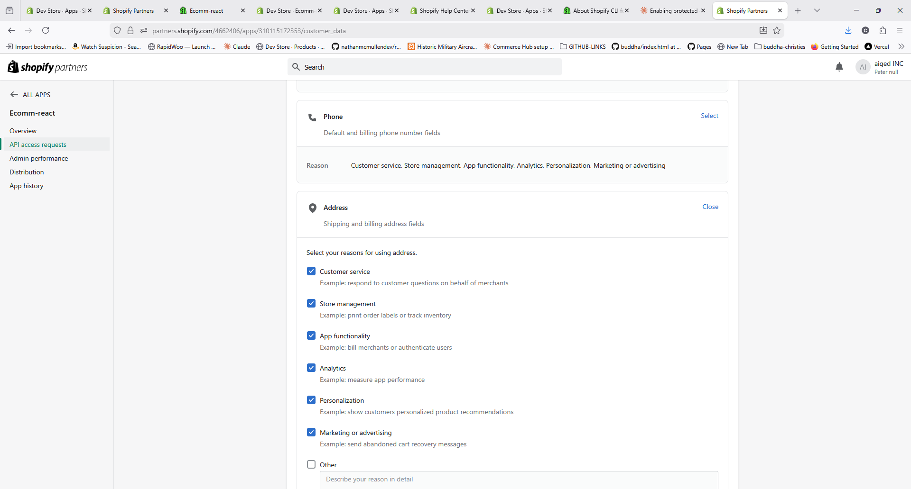

# Shopify Protected Customer Data Access - Complete Setup Guide

A comprehensive guide to setting up a Shopify app with Protected Customer Data access, from Partner account creation to API integration.

## Table of Contents

- [Overview](#overview)
- [Part 1: Setting Up Your Shopify Partner Account](#part-1-setting-up-your-shopify-partner-account)
- [Part 2: Creating a Development Store](#part-2-creating-a-development-store)
- [Part 3: Creating Your App](#part-3-creating-your-app)
- [Part 4: Configuring API Scopes](#part-4-configuring-api-scopes)
- [Part 5: Installing Your App](#part-5-installing-your-app)
- [Part 6: Getting API Access Tokens](#part-6-getting-api-access-tokens)
- [Part 7: Enabling Protected Customer Data Access](#part-7-enabling-protected-customer-data-access)
- [Part 8: Testing Your Setup](#part-8-testing-your-setup)
- [Troubleshooting](#troubleshooting)
- [Integration Examples](#integration-examples)

---

## Overview

### Why This Guide Exists

When building headless Shopify applications, you'll likely encounter this error:

```
ACCESS_DENIED: This app is not approved to access the DraftOrder object.
See https://shopify.dev/docs/apps/launch/protected-customer-data
```

This happens because Shopify requires explicit permission to access customer data (names, emails, addresses, phone numbers) - even if your app has the correct API scopes like `write_draft_orders` and `read_customers`.

**This guide solves that problem** by walking you through the complete setup process, from creating a Partner account to successfully creating draft orders with customer data.

### What You'll Learn

1. How to set up a Shopify Partner account and dev store
2. Creating and configuring a custom app
3. Understanding the difference between Partner Dashboard, Dev Dashboard, and Store Admin
4. Getting API access tokens (including the new client credentials flow)
5. Enabling Protected Customer Data access
6. Testing and verifying your setup

### Common Use Cases Requiring This Access

- Creating draft orders with customer shipping information
- Building custom checkout flows
- Processing customer data for fulfillment
- Building customer management dashboards
- Any app that reads/writes customer PII

---

## Part 1: Setting Up Your Shopify Partner Account

### Step 1.1: Create a Partner Account

1. Go to [partners.shopify.com](https://partners.shopify.com)
2. Click **"Join now"** or **"Log in"**
3. Fill out the registration form with your business information
4. Verify your email address

### Step 1.2: Complete the Getting Started Checklist

Once logged in, you'll see a Getting Started checklist. Complete as many items as relevant to your use case.



The checklist typically includes:
- Adding a development store
- Creating your first app
- Exploring the Partner Dashboard

---

## Part 2: Creating a Development Store

Development stores are free test stores where you can build and test your apps without affecting real customers or transactions.

### Step 2.1: Create a Dev Store

1. In Partner Dashboard, click **"Stores"** in the left sidebar
2. Click **"Add store"**
3. Select **"Development store"**
4. Choose your store type:
   - **Store to test and build** - For app development (recommended)
   - **Store to manage a client's business** - For agency work
5. Fill in store details:
   - Store name (e.g., `my-headless-store`)
   - Store purpose
   - Developer preview version (optional)
6. Click **"Create development store"**

### Step 2.2: Note Your Store Domain

Your dev store domain will be: `{store-name}.myshopify.com`

Save this - you'll need it for API calls.

---

## Part 3: Creating Your App

There are two ways to create apps in Shopify's ecosystem. Understanding the difference is crucial.

### Understanding the Dashboards

| Dashboard | Purpose | URL |
|-----------|---------|-----|
| **Partner Dashboard** | Manage apps, stores, billing, protected data access | partners.shopify.com |
| **Dev Dashboard** | Create app versions, configure scopes, deployment | dev.shopify.com |
| **Store Admin** | Manage a specific store's products, orders, settings | {store}.myshopify.com/admin |

### Step 3.1: Create App in Dev Dashboard

1. Go to [partners.shopify.com](https://partners.shopify.com)
2. Click **"Apps"** in the left sidebar
3. Click **"Create app"**
4. Choose **"Create app manually"** (not Shopify CLI for simple integrations)
5. Enter app details:
   - **App name**: e.g., "Headless Checkout"
   - **App URL**: Your app's URL (can be placeholder initially)
6. Click **"Create"**

### Step 3.2: Understand App Distribution Models

| Model | Best For | API Token Type |
|-------|----------|----------------|
| **Custom app (single store)** | Internal tools, one client | Static access token |
| **Public app (App Store)** | Multiple merchants | OAuth tokens per store |
| **Custom app via Dev Dashboard** | Development, headless commerce | Client credentials grant (24hr tokens) |

For headless commerce projects, you'll typically use the Dev Dashboard approach.

---

## Part 4: Configuring API Scopes

API scopes determine what your app can access. Without proper scopes, API calls will fail.

### Step 4.1: Navigate to App Configuration

1. In Dev Dashboard, go to your app
2. Click **"Configuration"** or **"Versions"**
3. Find the **"Scopes"** section

### Step 4.2: Add Required Scopes

For a headless checkout app, add these scopes (comma-separated):

```
read_customers,write_customers,write_draft_orders,read_draft_orders,read_orders,write_orders,read_products,write_products,read_inventory,write_inventory,read_discounts,write_discounts,read_fulfillments,write_fulfillments,read_locations,read_metaobjects,write_metaobjects
```

### Step 4.3: Create a Version

1. Enter a version name (e.g., "V1")
2. Click **"Release"** or **"Save"**

### Scope Reference

| Scope | Allows |
|-------|--------|
| `read_products` | View products and collections |
| `write_products` | Create/edit products |
| `read_orders` | View orders |
| `write_orders` | Create/edit orders |
| `read_draft_orders` | View draft orders |
| `write_draft_orders` | Create/edit draft orders |
| `read_customers` | View customer data |
| `write_customers` | Create/edit customers |
| `read_inventory` | View inventory levels |
| `write_inventory` | Adjust inventory |

---

## Part 5: Installing Your App

### Step 5.1: Install on Dev Store

1. In your app in Dev Dashboard, click **"Dev stores"** in the sidebar
2. Click **"Select store"** or **"Add store"**
3. Choose your development store
4. Click **"Install"**
5. Authorize the requested permissions

### Step 5.2: Verify Installation

Go to your store admin:
1. Navigate to `{store}.myshopify.com/admin`
2. Click **Settings** → **Apps and sales channels**
3. Confirm your app appears in the list

---

## Part 6: Getting API Access Tokens

This is where the new Dev Dashboard differs significantly from legacy custom apps.

### The Client Credentials Grant Flow

Apps created through the new Dev Dashboard use OAuth's **client credentials grant** to obtain access tokens. These tokens:
- Are valid for **24 hours**
- Must be refreshed before expiry
- Require your app's Client ID and Client Secret

### Step 6.1: Find Your Client Credentials

1. In Dev Dashboard, go to your app
2. Click **"Settings"** or look for **"Client credentials"**
3. Copy:
   - **Client ID**: e.g., `abc123def456...`
   - **Client Secret**: e.g., `shpss_xxxxxxxxxxxxx...`

### Step 6.2: Generate an Access Token

Make a POST request to your store's OAuth endpoint:

```bash
curl -X POST "https://{store}.myshopify.com/admin/oauth/access_token" \
  -H "Content-Type: application/x-www-form-urlencoded" \
  -d "grant_type=client_credentials" \
  -d "client_id={your_client_id}" \
  -d "client_secret={your_client_secret}"
```

**Response:**
```json
{
  "access_token": "shpua_843cad70c0b8087e594d3194d361b5b7",
  "scope": "write_customers,write_draft_orders,write_orders...",
  "expires_in": 86399
}
```

### Step 6.3: Store Your Token Securely

- The token (`shpua_...`) is your Admin API access token
- It expires in 24 hours (86399 seconds)
- Store it securely and implement token refresh in production

### Token Refresh Script (Production)

```javascript
async function getShopifyToken() {
  const response = await fetch(
    `https://${process.env.SHOPIFY_STORE}/admin/oauth/access_token`,
    {
      method: 'POST',
      headers: { 'Content-Type': 'application/x-www-form-urlencoded' },
      body: new URLSearchParams({
        grant_type: 'client_credentials',
        client_id: process.env.SHOPIFY_CLIENT_ID,
        client_secret: process.env.SHOPIFY_CLIENT_SECRET,
      }),
    }
  );

  const data = await response.json();
  return data.access_token;
}
```

---

## Part 7: Enabling Protected Customer Data Access

Even with proper scopes and tokens, you'll get `ACCESS_DENIED` errors when accessing customer data unless you enable Protected Customer Data access.

### Step 7.1: Navigate to API Access Requests

1. Go to [partners.shopify.com](https://partners.shopify.com)
2. Click **"Apps"** in the sidebar
3. Find your app (may be under "Dev Dashboard apps")
4. Click **"API access requests"**



### Step 7.2: Find Protected Customer Data Section

Scroll down to find **"Protected customer data access"**.


Click **"Request access"**.

> **Note:** For development stores, access is granted immediately. Production apps require Shopify review.

### Step 7.3: Select Data Use Reasons

Check all applicable reasons:



| Reason | When to Select |
|--------|----------------|
| Customer service | Support features |
| Store management | **Required for draft orders** |
| App functionality | Core operations |
| Analytics | Performance tracking |
| Personalization | Recommendations |
| Marketing | Email campaigns |

Click **"Save"**.

### Step 7.4: Configure Individual Field Access

You must configure access for each field type separately.

#### Name Field

Grants access to first name and last name fields.

#### Email Field

Grants access to customer email addresses.

#### Phone Field

Grants access to phone number fields.

#### Address Field

Grants access to shipping and billing addresses.

**Save each field configuration.**

---

## Part 8: Testing Your Setup

### Step 8.1: Test via cURL

```bash
curl -X POST "https://{store}.myshopify.com/admin/api/2024-01/graphql.json" \
  -H "Content-Type: application/json" \
  -H "X-Shopify-Access-Token: {your_access_token}" \
  -d '{
    "query": "mutation { draftOrderCreate(input: { email: \"test@example.com\", lineItems: [{ title: \"Test\", originalUnitPrice: \"10.00\", quantity: 1 }] }) { draftOrder { id name } userErrors { field message } } }"
  }'
```

### Step 8.2: Expected Success Response

```json
{
  "data": {
    "draftOrderCreate": {
      "draftOrder": {
        "id": "gid://shopify/DraftOrder/123456789",
        "name": "#D1"
      },
      "userErrors": []
    }
  }
}
```

### Step 8.3: Verify in Store Admin

1. Go to your store admin
2. Click **Orders** → **Drafts**
3. Your test draft order should appear

---

## Troubleshooting

### Error: `ACCESS_DENIED` for DraftOrder object

**Cause:** Protected customer data access not enabled.

**Solution:**
1. Go to Partner Dashboard → Apps → Your App → API access requests
2. Enable Protected Customer Data access
3. Configure all four field types (Name, Email, Phone, Address)
4. Save each configuration

### Error: `ACCESS_DENIED` for specific fields

**Cause:** Individual field access not configured.

**Solution:**
1. Go to Protected customer data section
2. Check that all fields show "Selected" with reasons
3. Re-configure any fields showing as not selected

### Error: Invalid access token

**Cause:** Token expired (24-hour limit) or invalid credentials.

**Solution:**
1. Generate a new token using client credentials grant
2. Verify Client ID and Secret are correct
3. Check that the store domain is correct

### Error: Scopes not sufficient

**Cause:** App missing required API scopes.

**Solution:**
1. Go to Dev Dashboard → Your App → Configuration
2. Add missing scopes
3. Create new version and release
4. Reinstall app on store
5. Generate new access token

### Token Refresh in Production

For production apps, implement automatic token refresh:

```javascript
let cachedToken = null;
let tokenExpiry = 0;

async function getValidToken() {
  // Refresh 5 minutes before expiry
  if (cachedToken && Date.now() < tokenExpiry - 300000) {
    return cachedToken;
  }

  const response = await fetch(/* client credentials request */);
  const data = await response.json();

  cachedToken = data.access_token;
  tokenExpiry = Date.now() + (data.expires_in * 1000);

  return cachedToken;
}
```

---

## Integration Examples

### Vercel Serverless Function

```typescript
// api/create-order.ts
import type { VercelRequest, VercelResponse } from '@vercel/node';

const SHOPIFY_STORE = process.env.SHOPIFY_STORE;
const SHOPIFY_ADMIN_TOKEN = process.env.SHOPIFY_ADMIN_TOKEN;

export default async function handler(req: VercelRequest, res: VercelResponse) {
  const { email, lineItems, shippingAddress } = req.body;

  const response = await fetch(
    `https://${SHOPIFY_STORE}/admin/api/2024-01/graphql.json`,
    {
      method: 'POST',
      headers: {
        'Content-Type': 'application/json',
        'X-Shopify-Access-Token': SHOPIFY_ADMIN_TOKEN,
      },
      body: JSON.stringify({
        query: DRAFT_ORDER_CREATE_MUTATION,
        variables: { input: { email, lineItems, shippingAddress } },
      }),
    }
  );

  const data = await response.json();
  return res.status(200).json(data);
}
```

### Environment Variables

```env
# .env.local
SHOPIFY_STORE=your-store.myshopify.com
SHOPIFY_CLIENT_ID=your_client_id
SHOPIFY_CLIENT_SECRET=your_client_secret
SHOPIFY_ADMIN_TOKEN=shpua_xxx (refresh every 24h)
```

---

## Summary Checklist

- [ ] Created Shopify Partner account
- [ ] Created development store
- [ ] Created app in Dev Dashboard
- [ ] Configured API scopes
- [ ] Released app version
- [ ] Installed app on dev store
- [ ] Obtained Client ID and Client Secret
- [ ] Generated access token via client credentials
- [ ] Enabled Protected Customer Data access
- [ ] Configured Name field access
- [ ] Configured Email field access
- [ ] Configured Phone field access
- [ ] Configured Address field access
- [ ] Tested draft order creation successfully

---

## Related Resources

- [Shopify Protected Customer Data Documentation](https://shopify.dev/docs/apps/launch/protected-customer-data)
- [Client Credentials Grant Documentation](https://shopify.dev/docs/apps/build/authentication-authorization/access-tokens/client-credentials-grant)
- [Shopify Admin API Scopes](https://shopify.dev/docs/api/usage/access-scopes)
- [Draft Orders API Reference](https://shopify.dev/docs/api/admin-graphql/latest/mutations/draftOrderCreate)
- [Shopify Dev Dashboard](https://dev.shopify.com)
- [Shopify Partner Dashboard](https://partners.shopify.com)

---

## Document Info

| Field | Value |
|-------|-------|
| Created | January 11, 2026 |
| Author | Hydrogen Forge Team |
| Version | 2.0 |
| Last Updated | January 11, 2026 |

---

*This guide is part of the [ecommerce-react-shopify](https://github.com/nathanmcmullendev/ecommerce-react) project. For questions or updates, please open an issue in the repository.*
